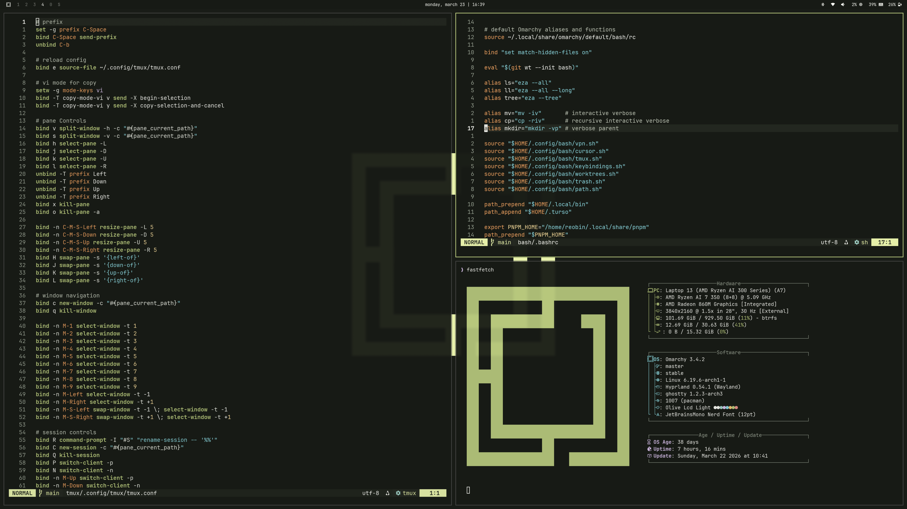

# `omarchy-olive-crt-dark-theme`

`omarchy-olive-crt-dark-theme` is a dark Omarchy theme built around [`reobin/olive-crt.nvim`](https://github.com/reobin/olive-crt.nvim).



## Installation

```bash
omarchy-theme-install https://github.com/reobin/omarchy-olive-crt-dark-theme.git
```

## Usage

Select `olive-crt-dark` from the Omarchy theme picker, or apply it with:

```bash
omarchy-theme-set olive-crt-dark
```
